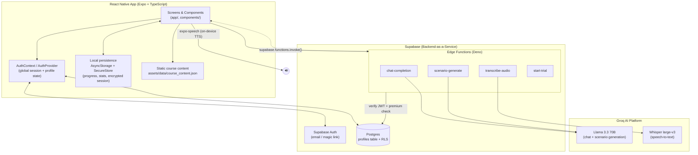
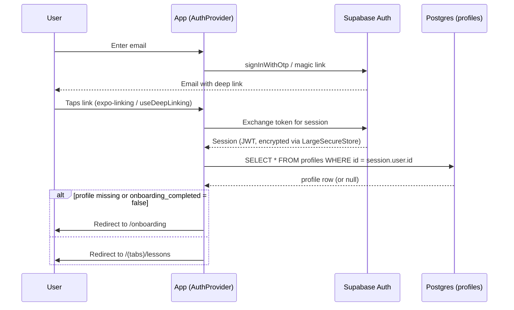
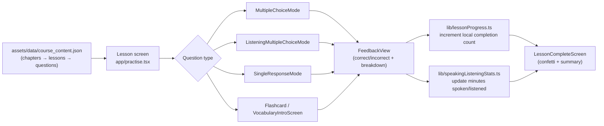
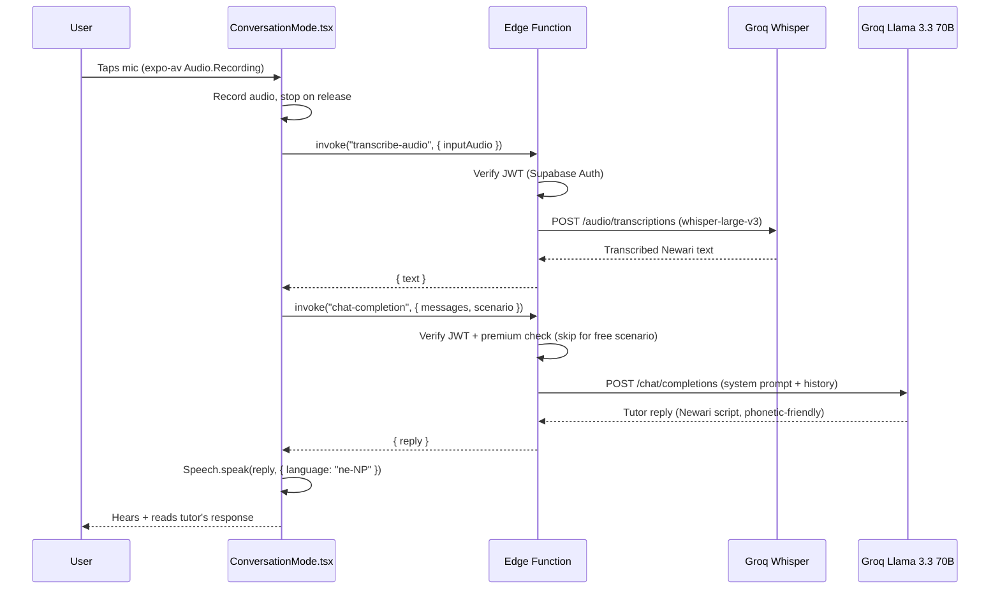
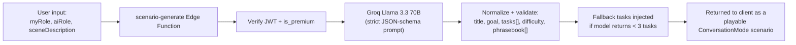

# नेवारी सिकौ — Newari (Nepal Bhasa) Language Learning App

A cross-platform mobile app that teaches **Nepal Bhasa (Newari)** through gamified lessons, AI-powered roleplay conversations, and live speech practice. Built with **React Native (Expo) + TypeScript** on the client and a serverless **Supabase** backend with **Groq**-hosted LLM/ASR models for the AI layer.

> Built solo by [@sthShres](https://github.com/sthShres) as an end-to-end product: mobile UI, auth, database, edge functions, and AI prompt/voice pipeline.

---

## Table of Contents

- [Overview](#overview)
- [Core Features](#core-features)
- [Tech Stack](#tech-stack)
- [System Architecture](#system-architecture)
- [Data Flow](#data-flow)
  - [1. Authentication](#1-authentication-flow)
  - [2. Structured Lessons](#2-structured-lesson-flow)
  - [3. AI Conversation Mode (Voice)](#3-ai-conversation-mode-voice)
  - [4. AI Scenario Generation](#4-ai-scenario-generation)
- [Database Schema](#database-schema)
- [Backend: Supabase Edge Functions](#backend-supabase-edge-functions)
- [Project Structure](#project-structure)
- [Security Model](#security-model)
- [Getting Started](#getting-started)
- [Environment Variables](#environment-variables)
- [Roadmap](#roadmap)

---

## Overview

Nepal Bhasa is a low-resource language with almost no digital learning tools. This app fills that gap with a Duolingo-style curriculum (multiple choice, listening, flashcards, audio prompts) combined with **freeform AI conversation practice**, where users roleplay real-life scenarios (ordering food, greetings, etc.) with an LLM tutor that replies in Newari script tuned for correct text-to-speech pronunciation.

The app is designed around three learning modes:

| Mode | Description |
|---|---|
| **Guided Lessons** | Chapter → Lesson → Question tree stored as static JSON, rendered through mode-specific components (multiple choice, listening MC, single response, flashcards). |
| **Roleplay Conversations** | Scripted scenarios (e.g. "Ordering Street Food") where the user speaks/types and an LLM tutor responds in-character, in Newari. |
| **Custom Scenarios (Premium)** | Users describe their own scene; an LLM generates a new scenario (title, goal, tasks, phrasebook) on demand. |

---

## Core Features

- 🔐 **Email/magic-link auth** via Supabase Auth, with encrypted session persistence
- 📚 **Structured curriculum** — chapters, lessons, and 5+ question types driven by a local content JSON file
- 🗣️ **Voice conversations** — record → transcribe (Whisper) → LLM reply → text-to-speech, in a loop
- 🤖 **AI roleplay tutor** — Groq-hosted Llama 3.3 70B constrained by a strict system prompt (persona, language, phonetic spelling rules, safety guardrails)
- ✍️ **Custom scenario generation** — user-described scenes turned into structured lesson scenarios by the LLM
- 📊 **Local progress tracking** — lesson completion counts and speaking/listening minutes tracked on-device
- 💎 **Freemium gating** — one free scenario, premium-gated AI features, and a server-issued 7-day trial
- 🌓 **Themed UI** — custom design system, animations (Reanimated), haptics, and confetti-driven celebration screens
- 🔗 **Deep linking** — magic-link auth callbacks handled via Expo Router + `expo-linking`

---

## Tech Stack

**Client**
- React Native 0.81 + React 19, TypeScript
- Expo SDK 54, Expo Router (file-based navigation)
- Reanimated + Gesture Handler for animation/interaction
- `expo-av` (audio recording/playback), `expo-speech` (TTS), `expo-sqlite`, `expo-secure-store`
- AsyncStorage for lightweight local persistence

**Backend (BaaS + Serverless)**
- Supabase Postgres (with Row Level Security)
- Supabase Auth (email + magic link)
- Supabase Edge Functions (Deno runtime) — the app's only server-side compute layer

**AI / ML**
- Groq API — `llama-3.3-70b-versatile` for conversation & scenario generation
- Groq Whisper (`whisper-large-v3`) for speech-to-text
- `expo-speech` for on-device text-to-speech output

**Tooling**
- ESLint (`eslint-config-expo`), TypeScript strict mode, EAS Build/Submit (`eas.json`)

---

## System Architecture

The app follows a **thin-client / BaaS** architecture: the React Native app never talks to third-party AI providers directly. All AI calls are proxied through Supabase Edge Functions, which enforce auth and premium entitlement checks before spending API credits. This keeps API keys off the device and centralizes business rules (paywalls, rate limiting) on the server.



**Why this shape?**
- **No secrets on device** — the Groq API key lives only in Edge Function environment variables.
- **Single source of truth for entitlements** — `is_premium` / `premium_expires_at` are checked server-side inside each Edge Function, not just in the UI, so the paywall can't be bypassed by patching the client.
- **Stateless functions** — each Edge Function independently authenticates the caller via the Supabase JWT, making them safe to scale horizontally.
- **Static content, dynamic AI** — the guided curriculum is bundled JSON (fast, offline-friendly, no LLM cost), while only the open-ended conversation/scenario features hit the LLM.

---

## Data Flow

### 1. Authentication Flow



Session tokens are never stored in plain AsyncStorage. `utils/supabase.ts` implements a custom `LargeSecureStore`: it generates a random AES key per write, encrypts the session payload with `aes-js`, stores the ciphertext in AsyncStorage, and stores the encryption key itself in `expo-secure-store` (iOS Keychain / Android Keystore).

### 2. Structured Lesson Flow



Progress and speaking/listening stats are intentionally kept **on-device** (AsyncStorage) rather than synced to Postgres — this keeps the free tier fully functional offline and avoids write-heavy tables for a metric that's only ever read by the owning user.

### 3. AI Conversation Mode (Voice)

This is the core AI feature (`components/conversation/ConversationMode.tsx`), a full record → transcribe → generate → speak loop:



The `chat-completion` system prompt is engineered specifically for Nepal Bhasa: it instructs the model to reply only in Newari, to spell words phonetically so that `expo-speech`'s `ne-NP` voice pronounces them correctly (e.g. rewriting ज्वजलपा as जोजोलापा), and it treats any scenario metadata as untrusted descriptive text rather than executable instructions — a prompt-injection guardrail since scenario content can originate from user-generated custom scenarios.

### 4. AI Scenario Generation

Premium users can describe a scene in their own words; the `scenario-generate` Edge Function turns that into a structured, playable scenario:



Output is defensively normalized (`normalizeText`, `normalizeTasks`) before it ever reaches the client, so a malformed or adversarial LLM response can't break the UI.

---

## Database Schema

Only one core table currently lives in Postgres — everything else (lesson content, local progress) is client-side by design. Access is fully locked down with **Row Level Security**.

```sql
create table public.profiles (
  id                    uuid references auth.users primary key,
  full_name             text,
  chinese_level         text,      -- legacy column name; stores learner's self-rated level
  motivations           text[],
  interests             text[],
  onboarding_completed  boolean default false,
  is_premium            boolean default false,
  premium_expires_at    timestamptz,
  updated_at            timestamptz default now()
);
```

**RLS policies:**

| Policy | Effect |
|---|---|
| `Users can read own profile` | `SELECT` allowed only where `auth.uid() = id` |
| `Users can insert own profile` | `INSERT` allowed only for own row |
| `Users can update own profile` | `UPDATE` allowed only for own row |

Column-level grants further restrict `UPDATE`/`INSERT` from the `authenticated` role to a safe subset of columns (name, level, motivations, interests, onboarding flag) — **`is_premium` and `premium_expires_at` are deliberately excluded from client grants**, so entitlement can only be changed by the `start-trial` Edge Function using the Supabase **service role key**, never directly by the app.

---

## Backend: Supabase Edge Functions

All server logic lives in `supabase/functions/`, written in TypeScript on Deno.

| Function | Auth required | Purpose |
|---|---|---|
| `chat-completion` | JWT + premium (unless free scenario) | Drives the AI roleplay conversation; calls Groq's Llama 3.3 70B with a Newari-tutor system prompt |
| `transcribe-audio` | JWT | Sends recorded audio to Groq Whisper (`whisper-large-v3`) and returns transcribed text |
| `scenario-generate` | JWT + premium | Converts a free-text scene description into a structured, validated scenario object |
| `start-trial` | JWT (uses service role internally) | Grants a 7-day premium trial by writing `is_premium`/`premium_expires_at` with elevated privileges |

Every function follows the same guard pattern: validate the `Authorization` header → resolve the user via `supabase.auth.getUser()` → (optionally) check `profiles.is_premium` → call the third-party API → return a scoped JSON response. CORS is handled uniformly across all four functions.

---

## Project Structure

```
.
├── app/                        # Expo Router file-based routes
│   ├── (tabs)/                 # Bottom-tab screens: lessons, conversations, profile
│   ├── _layout.tsx             # Root layout: auth gate, onboarding redirect, fonts
│   ├── conversation.tsx        # Roleplay conversation screen
│   ├── practise.tsx            # Structured lesson runner
│   └── onboarding.tsx          # First-run onboarding flow
├── components/
│   ├── auth/                   # Email auth UI, intro/landing screen
│   ├── conversation/           # ConversationMode.tsx — voice loop UI + logic
│   ├── lesson/                 # Question-type components (MC, listening, flashcards, etc.)
│   ├── subscription/           # Paywall.tsx
│   └── ui/                     # Shared primitives (dialogs, icons, themed views)
├── constants/                  # Static course metadata, theme tokens
├── ctx/                        # React Context definitions (AuthContext)
├── providers/                  # Context providers (AuthProvider — session/profile logic)
├── hooks/                      # useDeepLinking, useSpeakingListeningStats, theme hooks
├── lib/                        # Local-storage business logic (progress, stats, custom scenarios)
├── utils/supabase.ts           # Supabase client + encrypted secure storage adapter
├── assets/data/                # course_content.json — chapters/lessons/questions & scenarios
└── supabase/
    ├── functions/               # Edge Functions (chat-completion, transcribe-audio, scenario-generate, start-trial)
    └── migrations/               # SQL schema + RLS policies
```

---

## Security Model

- **Encrypted session storage** — auth tokens are AES-encrypted before touching AsyncStorage; the AES key itself lives in the OS-level secure enclave via `expo-secure-store`.
- **Row Level Security everywhere** — no table is readable/writable across users; `auth.uid()` is the only key.
- **Column-level grants** — sensitive billing fields (`is_premium`, `premium_expires_at`) are excluded from the client's `UPDATE`/`INSERT` grants and can only be set server-side with the service role key.
- **Server-side entitlement checks** — every premium-gated Edge Function re-verifies `is_premium` against Postgres; the client-side paywall is a UX convenience, not the source of truth.
- **Prompt-injection guardrails** — LLM system prompts explicitly instruct the model to treat scenario text as untrusted data, not instructions, since scenario content can be user-generated.
- **No third-party keys on-device** — the Groq API key never ships in the app bundle; all AI calls are proxied through Edge Functions.

---

## Getting Started

### Prerequisites
- Node.js 18+
- Expo CLI (`npx expo`)
- A Supabase project (Postgres + Auth + Edge Functions + Storage)
- A Groq API key ([console.groq.com](https://console.groq.com))

### Install & Run

```bash
# Install dependencies
npm install

# Start the Expo dev server
npx expo start
```

Then choose to open the app in a development build, Android emulator, iOS simulator, or Expo Go.

### Backend Setup

```bash
# Link and push the database schema
supabase link --project-ref <your-project-ref>
supabase db push

# Deploy Edge Functions
supabase functions deploy chat-completion
supabase functions deploy transcribe-audio
supabase functions deploy scenario-generate
supabase functions deploy start-trial

# Set required secrets
supabase secrets set GROQ_API_KEY=your_groq_key
```

---

## Environment Variables

Create a `.env` file at the project root:

```bash
EXPO_PUBLIC_SUPABASE_URL=https://<your-project>.supabase.co
EXPO_PUBLIC_SUPABASE_KEY=<your-supabase-anon-key>
```

Edge Function secrets (set via `supabase secrets set`, never exposed to the client):

```bash
SUPABASE_URL=
SUPABASE_ANON_KEY=
SUPABASE_SERVICE_ROLE_KEY=
GROQ_API_KEY=
```

---

## Roadmap

- [ ] Sync lesson progress to Postgres for cross-device continuity
- [ ] Streaming LLM responses for lower perceived latency in conversation mode
- [ ] Native in-app purchases (replacing the time-boxed trial with real subscription billing)
- [ ] Spaced-repetition scheduling for vocabulary review
- [ ] Expanded curriculum content (additional chapters/scenarios)

---

## License

Specify a license (MIT, Apache-2.0, etc.) here, or mark the repository as proprietary/private.
